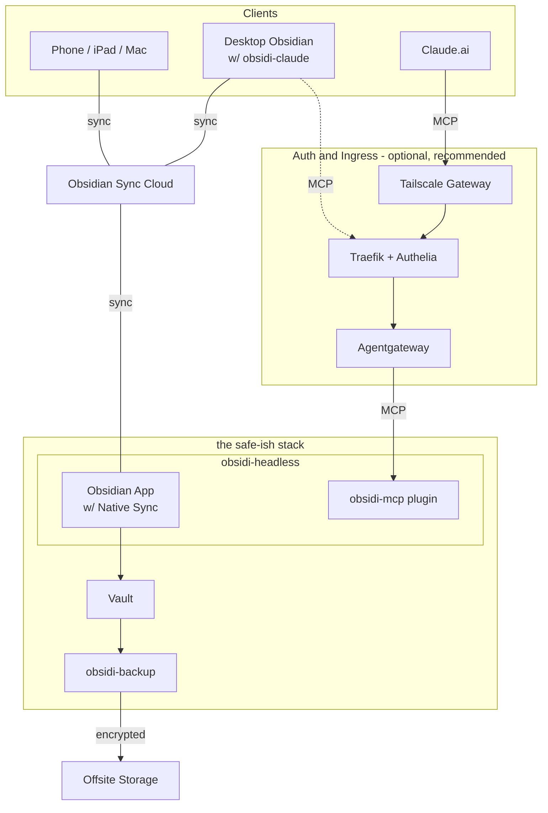

# obaass — obsidian as-a safe-ish service


Run Obsidian headlessly on a server. One `docker compose up` gives you three compounding capabilities:

1. **Multi-Device Sync** — Obsidian Sync keeps the server copy current with all your devices
2. **Encrypted Backup** — Every change gets a git commit with an AI-generated message + encrypted offsite backup
3. **AI Agent Access** — Claude (or any MCP client) can read and write your vault

## Why

Obsidian is a desktop app. No server mode. No native API. Sync is built into the desktop client. Every feature assumes a human sitting at a screen.

Obsidian v1.8+ shipped a native CLI that talks to the running app via IPC. That was the inflection point — suddenly you could control Obsidian programmatically without a GUI, a REST API plugin, or a VNC desktop environment. obaass exists because of that release.

obaass runs the desktop app headlessly on a server. That single decision unlocks capabilities Obsidian was never designed to support — and they compound:

- Phone edit via Sync -> Server receives it -> Backup captures it -> AI can read it via MCP
- AI writes a note via MCP -> Sync propagates to all devices -> Backup captures the change
- Backup restores a file -> Sync propagates the restore -> AI and all devices see it

Your vault becomes a **living, distributed knowledge base** accessible from any device, any AI agent, and recoverable from any point in time.

## How It Works


<details>
<summary>Mermaid source</summary>



</details>

### obsidi-headless

The [`obsidi-headless`](https://github.com/cameronsjo/obsidi-headless) image runs the Obsidian desktop app with a virtual framebuffer (Xvfb) instead of a real display. Electron needs a display server — Xvfb satisfies that requirement with zero overhead. No VNC, no desktop environment, no window manager.

Obsidian Sync runs inside the app, keeping the server-side vault in sync with all your devices. The native CLI (Obsidian 1.12+) provides programmatic access.

### obsidi-backup

The [`obsidi-backup`](https://github.com/cameronsjo/obsidi-backup) sidecar watches the vault directory for filesystem changes using inotify. After a configurable debounce period (default: 5 minutes), it:

1. Commits changes to git with an AI-generated message describing what changed (or falls back to a timestamp)
2. Encrypts and deduplicates to offsite storage via restic
3. Prunes old snapshots per retention policy (7 daily, 4 weekly, 12 monthly)
4. Notifies via Discord, Slack, or generic webhook

### obsidi-mcp

An Obsidian community plugin that runs inside the headless container, exposing vault operations as MCP tools. AI agents (Claude.ai, obsidi-claude, or any MCP client) connect through your auth/ingress layer to read and write notes, search, manage tags, and more. See [docs/mcp-integration.md](docs/mcp-integration.md) for the full setup guide.

### obsidi-claude

A chatbot-style UI plugin for the desktop Obsidian app. It connects to the server's obsidi-mcp over the network — so you can chat with your vault from your laptop while the server handles the heavy lifting, backup, and sync.

### Components

| Component | Type | Purpose |
|-----------|------|---------|
| [`obsidi-headless`](https://github.com/cameronsjo/obsidi-headless) | Container | Obsidian desktop app running headlessly via Xvfb — no VNC, no desktop environment |
| [`obsidi-backup`](https://github.com/cameronsjo/obsidi-backup) | Container | Filesystem watcher -> AI-summarized git commits -> encrypted restic snapshots -> notifications |
| [`obsidi-mcp`](https://github.com/cameronsjo/obsidi-mcp) | Obsidian plugin | MCP server running inside the headless app — gives AI agents read/write vault access |
| [`obsidi-claude`](https://github.com/cameronsjo/obsidi-claude) | Obsidian plugin | Chatbot UI for the desktop app — talks to the server's obsidi-mcp over the network |

**obsidi-headless** and **obsidi-backup** run on the server as Docker containers. **obsidi-mcp** is an Obsidian plugin installed inside the headless container. **obsidi-claude** is an Obsidian plugin for your desktop/laptop — it connects to the server through your auth layer.

See [docs/architecture.md](docs/architecture.md) for the detailed backup pipeline, data flow sequences, and the compounding capabilities model.

## Quick Start

```bash
git clone https://github.com/cameronsjo/obaass.git
cd obaass
cp .env.example .env
# Edit .env with your settings

mkdir -p vault  # Or point VAULT_PATH to an existing vault
docker compose up -d
```

### Prerequisites

- Docker and Docker Compose
- An Obsidian vault (or an empty directory to start one)
- Obsidian Sync subscription (for multi-device sync)
- Obsidian Catalyst license (for CLI access, required by obsidi-mcp)

### First-Time Sync Setup

After the first boot, enable Obsidian Sync to pull your vault:

1. The Obsidian app is running headlessly — there's no GUI to click through
2. Use the CLI to configure sync (see [docs/sync-setup.md](docs/sync-setup.md))
3. Once authenticated, Sync runs automatically on every restart

<details>
<summary>Configuration</summary>

All configuration is via environment variables in `.env`. See [.env.example](.env.example) for the full list.

#### Core

| Variable | Default | Description |
|----------|---------|-------------|
| `VAULT_PATH` | `.` | Directory containing your `vault/` folder |
| `TZ` | `UTC` | Timezone |

#### Backup

| Variable | Default | Description |
|----------|---------|-------------|
| `BACKUP_DEBOUNCE` | `300` | Seconds to wait after last change before committing |
| `GIT_USER_NAME` | `Obsidian Backup` | Git author name |
| `GIT_USER_EMAIL` | `backup@local` | Git author email |

#### Offsite Backup

| Variable | Description |
|----------|-------------|
| `RESTIC_REPOSITORY` | Restic repo URL (S3, Azure, B2, local path) |
| `RESTIC_PASSWORD` | Encryption password for the restic repository |

#### AI Commit Messages

| Variable | Default | Description |
|----------|---------|-------------|
| `ANTHROPIC_API_KEY` | — | Anthropic API key for AI-generated commit messages |
| `ANTHROPIC_MODEL` | `claude-haiku-4-5-20251001` | Model to use |

#### Notifications

| Variable | Description |
|----------|-------------|
| `DISCORD_WEBHOOK_URL` | Discord webhook for backup notifications |

</details>

## License

[PolyForm Noncommercial 1.0.0](LICENSE). Commercial use requires a separate license — [get in touch](https://github.com/cameronsjo).
