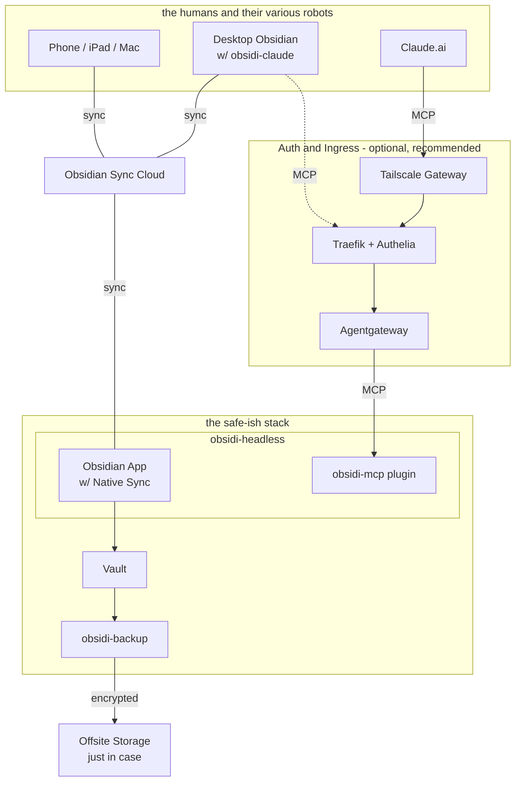
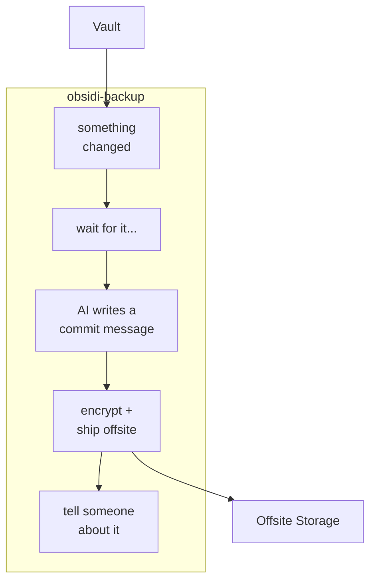
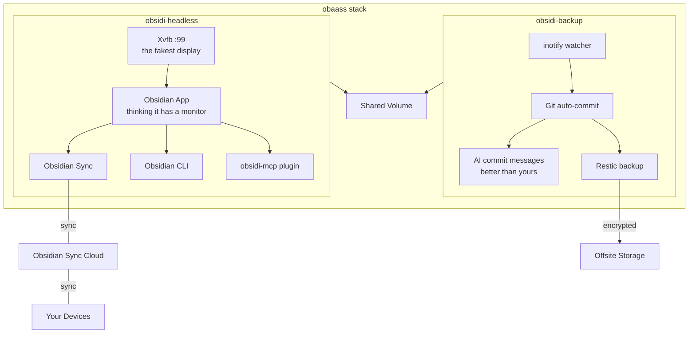
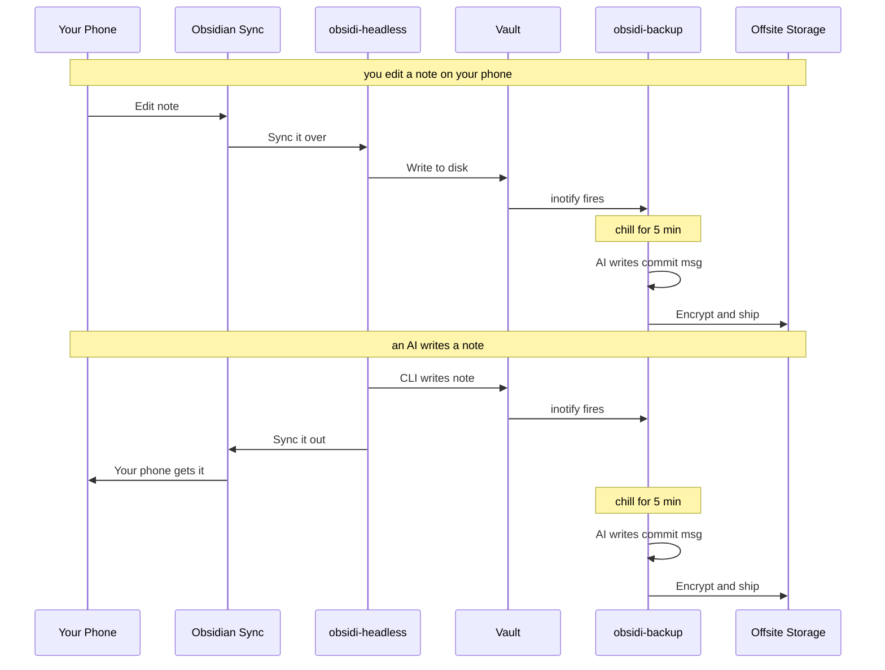
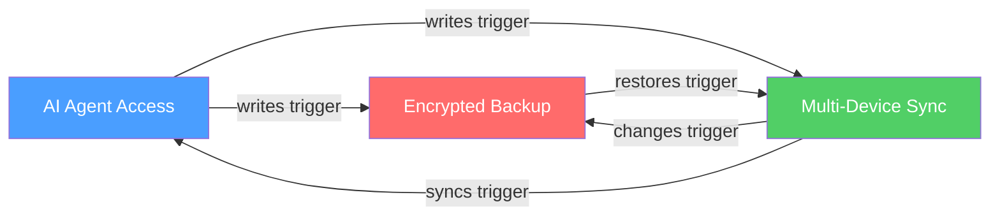

# Architecture

## The Pattern

Obsidian is a desktop app. No server mode. No native API. No headless option. obaass runs it on a server anyway, because apparently that's how we spend our weekends now.

## the safe-ish stack

Three paths into one vault. Sync keeps it current, backup keeps it safe-ish, MCP lets the robots in.

**Three paths, one vault:**

| Path | Route | What's happening |
|------|-------|------------------|
| **Sync** | Device <-> Obsidian Sync Cloud <-> obsidi-headless | Your phone edit shows up on the server in seconds. And vice versa. It's kind of magic |
| **Claude.ai** | Claude.ai -> Tailscale -> Agentgateway -> obsidi-mcp | An AI agent reading your grocery list. The future is now |
| **obsidi-claude** | Desktop plugin -> Traefik/Authelia -> Agentgateway -> obsidi-mcp | Chat with your vault from your laptop. The server does the thinking |

**Key distinction:** obsidi-claude is a chatbot plugin for the _desktop_ Obsidian app (the one with a screen). It connects to the _server's_ obsidi-mcp over the network through your auth layer. It does not run inside obsidi-headless. Two different plugins, two different machines, one vault.

## Backup Pipeline Detail

What happens when you change a file. Every time. Whether you asked for it or not.

inotify detects the change. Debounce waits for you to stop typing (5 minutes of quiet, configurable). Git commits with an AI-generated message that actually describes what changed instead of "updated files". Restic encrypts, deduplicates, and ships to offsite storage. Then it tells you about it. Retention: 7 daily, 4 weekly, 12 monthly snapshots. Your notes are probably safer than your tax documents.

## Container Architecture

For the people who want to see what's actually inside the boxes.

## Data Flow

Two scenarios. Both end with your notes backed up. That's the point.

## Compounding Capabilities

These three things work alone. Together they form a loop where everything reinforces everything else. It's the good kind of circular dependency.

- AI writes a note -> Sync propagates to all devices -> Backup captures the change
- Phone edit -> Server receives via Sync -> Backup captures -> AI can read it
- Backup restores a file -> Sync propagates -> AI and all devices see it

## Why Xvfb?

Obsidian is an Electron app. Electron requires a display server — it will literally refuse to start without one. Xvfb (X Virtual Framebuffer) satisfies this requirement with a virtual display that renders to memory. Nothing is actually drawn. It's a display for an app with no eyes.

| Approach | Image Size | Overhead | GUI Access |
|----------|-----------|----------|------------|
| KasmVNC + XFCE (v1) | ~800MB+ | High — entire desktop environment for one app | Yes (browser) |
| **Xvfb only (v2)** | **~400MB** | **Minimal — just enough to trick Electron** | **No** |

v1 shipped an entire desktop environment just to run a single app. v2 strips all of that away. If you need a GUI, use a real device. The server is for Sync, CLI, and backup. It doesn't need to see.
