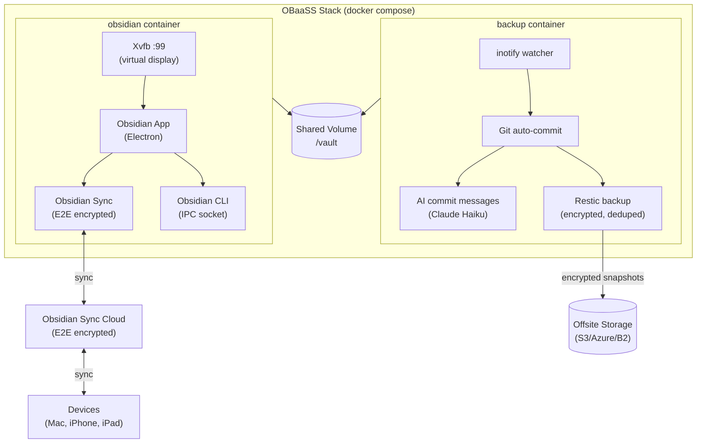
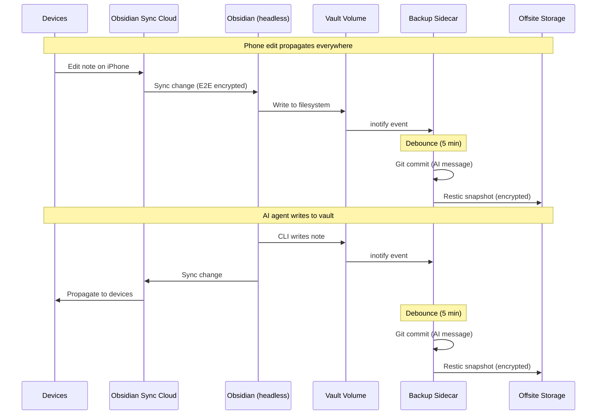
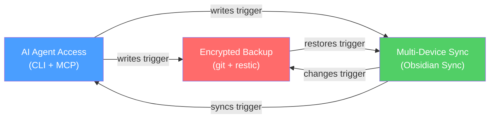

# Architecture

## The Pattern

Obsidian is a desktop app — no server mode, no native API, no headless option. OBaaSS runs it on a server anyway, unlocking three capabilities that compound.

## Container Architecture

## Data Flow

## Compounding Capabilities

Each capability works independently. Together they form a feedback loop:

- AI writes a note -> Sync propagates to all devices -> Backup captures the change
- Phone edit -> Server receives via Sync -> Backup captures -> AI can read it
- Backup restores a file -> Sync propagates -> AI and all devices see it

## Why Xvfb?

Obsidian is an Electron app. Electron requires a display server — it won't start without one. Xvfb (X Virtual Framebuffer) satisfies this requirement with a virtual display that renders to memory. Nothing is actually drawn; it's just enough to keep Electron happy.

| Approach | Image Size | Overhead | GUI Access |
|----------|-----------|----------|------------|
| KasmVNC + XFCE (v1) | ~800MB+ | High (VNC, WM, desktop) | Yes (browser) |
| **Xvfb only (v2)** | **~400MB** | **Minimal (framebuffer)** | **No** |

The v1 approach shipped an entire desktop environment just to run a single app. v2 strips that away — if you need a GUI, use a real device. The server is for Sync, CLI, and backup.
